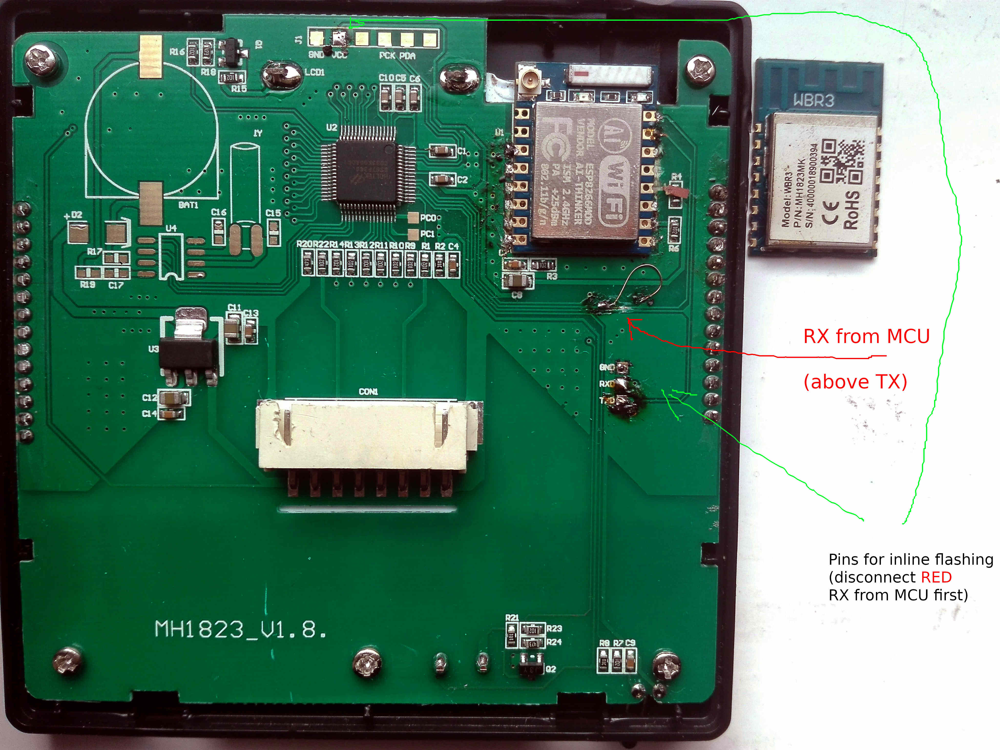
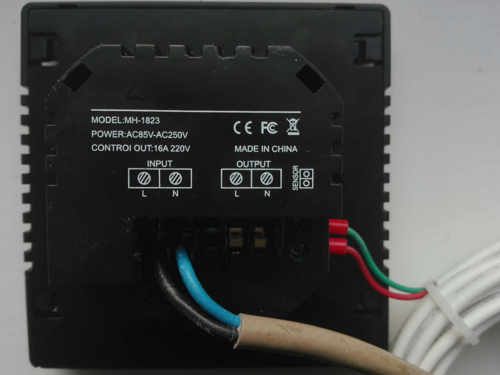
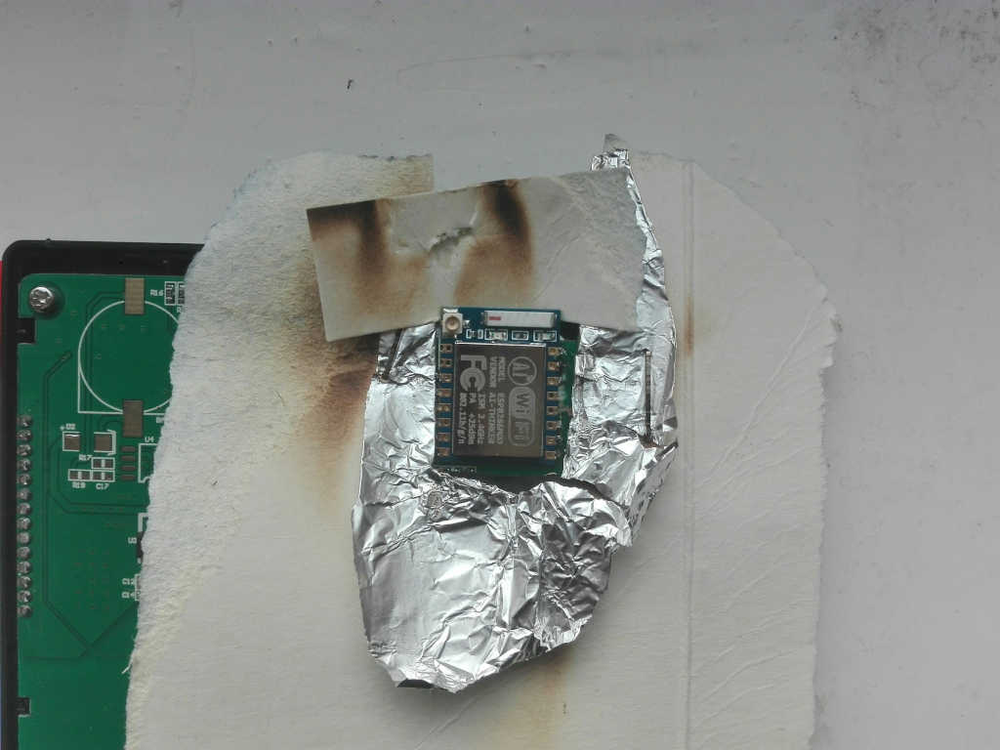

# ThermostatBecaWifi MH-1823

This is a fork off Klaus Ahrenberg's open source thermostat firmware project https://github.com/klausahrenberg/WThermostatBeca/ to support my Tuya compatible MH-1823 wifi thermostats. CAVE: those originally use a WBR3 Module (RTL8720) which is incompatible with the ESP8266 firmware, so I replaced it with an ESP-07 (pin compatible). Unsoldering worked reasonably well with a hot air gun (pics on request).

Usage see below, and don't forget to set your thermostat to MH-1823 from the default BHT-002!

The MCU product is a "Holtek bs67f360 BAC" with product version 4dl9hkne.

How to check if this will work with your thermostat's MCU  (you don't need the secret for the version check):

> $ python3 -m tuyapower
> 
> TuyaPower (Tuya compatible smart plug scanner) [0.0.25] tinytuya [1.2.1]
> 
> Scanning on UDP ports 6666 and 6667 for devices (15 retries)...
> 
> FOUND Device [Valid payload]: 192.168.2.230
>     ID = bfb9c8eb2f4f79bf82eesm, product = 4dl9hkne, Version = 3.3
>     Device Key required to poll for stats

 


DPS List for MH-1823
--------------------
```
1 on/off
2 manual/program/holiday (holiday -> 32: days remaining)
3 start/stop (heater relay)

5 lock

9 antifreeze

18 sensor in/out/in_out
19 c/f

22 desired temp

32 undefined/number of holidays left
33 sensor in in o C * 10


35 t comp in sensor
36 wifi signal strength request/info
37 sensor in in F * 10

39 working day mode 6_1/5_2/7

42 programming string in base64 e. g. AAYCxgAIAk4eCwJOHgwCTgARAsYAFgJOAAgCxgAXAk4=
45 wifi request/info

101: floor temp in C * 10
102: floor temp in F * 10
103 t comp out sensor
104 t slewing (hysteresis?)
105 power on/off on lock (power/no_power)
106: 35 ???
107: 96 ???
```
There are a few that the MCU throws out initializing but I haven't found out what they do yet: 0xc, 0x17, 0x20, 0x6a, 0x6b
```
thermostat_kueche {"error":"Unknown MCU command: 55 aa 03 07 00 05 0c 01 00 01 00"}
thermostat_kueche {"error":"Unknown MCU command: 55 aa 03 07 00 08 17 02 00 04 00 00 00 45"}
thermostat_kueche {"error":"Unknown MCU command: 55 aa 03 07 00 08 20 02 00 04 00 00 00 01"}
thermostat_kueche {"error":"Unknown MCU command: 55 aa 03 07 00 08 6a 02 00 04 00 00 00 23"}
thermostat_kueche {"error":"Unknown MCU command: 55 aa 03 07 00 08 6b 02 00 04 00 00 00 5f"}
```

I got most of the DPs via tuya-mqtt after obtaining their "secrets" from the cloud by installing the Smart Life App, creating a Tuya IoT dev account, linking this to the Smart Life App, and pulling the secrets via tinytuya wizard from the cloud. The MCU speaks Tuya serial protocol version 3. The easiest way to access the original WBR3 firmware (provided you have the local key from the cloud) is probably with tuya-cli, e. g. target temperature:

> tuya-cli get   --ip 192.168.x.y --id bfb9c8eb2f4f79bf82eesm --key 10d6a51aa4b88bbd --protocol-version 3.3 --dps 22
> 
> tuya-cli set   --ip 192.168.x.y --id bfb9c8eb2f4f79bf82eesm --key 10d6a51aa4b88bbd --protocol-version 3.3 --dps 22 --set 16

In the current version, it publishes some of the data via MQTT: deviceOn, relay, actualTemperature, actualFloorTemperature, targetTemperature

With fashbergs firmware I also managed to try out some of the commands.


Shielding for hot air gun desoldering
-------------------------------------

 

Serial Protocol
---------------
More info on the Tuya serial protocol version 3 can be found here:

https://developer.tuya.com/en/docs/iot/smart-product-solution/product-solutiongateway/gateway-mcu-access-solution/tuya-gateway-mcu-access-communication-protocol

https://developer.tuya.com/en/docs/iot/device-development/embedded-software-development/mcu-development-access/wifi-mcu-sdk-solution/tuya-cloud-universal-serial-port-access-protocol

Theo Arends has also done some work on the Tuya devices, but I haven't tried Tasmota for the thermostats yet.

https://tasmota.github.io/docs/TuyaMCU/


Changes (mostly in the MH-1823 branch)
-------

* child lock on/off
* separate temperature factors for desired and actual temperatures
* wifi status including rssi
* floor temperature

Usage
-----

The fork works mostly like Klaus' original version. Examples:
```
mosquitto_pub -h localhost -t thermostat_xxx/thermostat/set/locked  -m "true"
mosquitto_pub -h localhost -t thermostat_xxx/thermostat/set/targetTemperature  -m "20.0"
mosquitto_pub -h localhost -t thermostat_xxx/thermostat/set/systemMode  -m "manual"
state:
http://thermostat_xxx/things/thermostat/properties
schema:
http://thermostat_xxx/things/thermostat/debug
read a single property via http:
http://thermostat_xxx/things/thermostat/properties/relay
```


